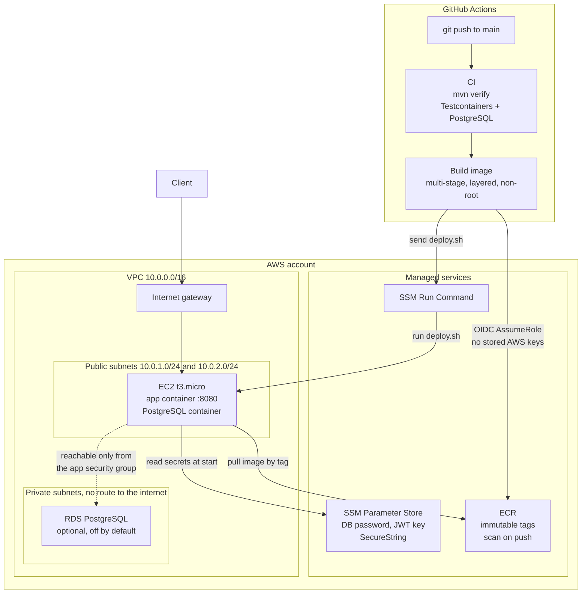

# User Service

A JWT authentication and user-management microservice, with the infrastructure
it runs on defined as code.

The application is Spring Boot 4 on Java 21. Everything around it — the VPC it
sits in, the registry its images live in, the roles that let the pipeline talk
to AWS, and the pipeline itself — is in this repository. `terraform apply`
builds the environment from nothing; a push to `main` tests, builds, publishes
and deploys.

---

## Architecture



*A rendered copy lives at [`docs/architecture.svg`](docs/architecture.svg) for viewers that do not render Mermaid.*

### How a deploy actually happens

1. A push to `main` runs the full test suite, including integration tests that
   start a real PostgreSQL through Testcontainers and assert that the Flyway
   schema satisfies Hibernate's validation.
2. GitHub requests an OIDC token and exchanges it for temporary AWS
   credentials. **No AWS access key is stored in this repository.** The role's
   trust policy names this repository and the `main` ref specifically.
3. The image is built and pushed to ECR, tagged with the commit SHA.
4. The pipeline sends `scripts/deploy.sh` to the instance through SSM Run
   Command. The instance pulls the image using its own role, reads the database
   password and JWT signing key from Parameter Store, and starts the container.
5. If the new container does not report `UP` within three minutes, the script
   starts the previous image again and the job fails.
6. The pipeline then curls the public address from outside AWS, so a green run
   means the service is genuinely reachable, not merely started.

---

## The decisions worth explaining

| Decision | Why |
|---|---|
| GitHub OIDC instead of an access key | A stored `AWS_SECRET_ACCESS_KEY` is a permanent credential in a place many people can read. OIDC issues a token that lives for the length of one job and is bound to this repo and ref. |
| Database security group references the app's security group, not a CIDR | Membership of the app group is what grants access. Another instance in the same subnet still cannot reach the database. |
| No NAT gateway | It costs roughly USD 32/month plus data processing and is the most common source of an unexpected AWS bill. Nothing here needs outbound access from the private subnets. |
| SSM Session Manager instead of SSH | Port 22 is closed and there is no key pair. Access is authorised by IAM and logged by CloudTrail. |
| IMDSv2 required | IMDSv1's unauthenticated request turns a server-side request forgery bug into leaked instance credentials. |
| Immutable ECR tags, tagged by commit SHA | `latest` is not a version. An immutable tag means a deploy can always be reproduced or rolled back to exactly. |
| Flyway with `ddl-auto: validate` | `ddl-auto: update` lets Hibernate alter production schema on startup. Flyway makes every change a reviewed, ordered, replayable file; `validate` fails fast if the two ever drift. |
| Layered jar extraction in the Dockerfile | Dependencies change rarely, application classes change every commit. Splitting them means a redeploy ships kilobytes instead of ~60 MB. |
| Container runs as an unprivileged user | A container running as root is one kernel escape from being root on the host. |
| `MaxRAMPercentage` rather than a fixed `-Xmx` | The JVM otherwise sizes its heap from the host's RAM and ignores the container limit, which is the usual reason a Java container gets OOM-killed on a small instance. |
| Secrets in Parameter Store, read at container start | Nothing sensitive is in the image, in `user_data`, in Terraform state output, or on the host's disk. |
| Argon2 password hashing | Memory-hard, so GPU brute-forcing is far more expensive than against bcrypt. |

---

## Application

Spring Boot 4.1 · Java 21 · PostgreSQL 16 · Spring Security · JJWT · Flyway ·
springdoc-openapi · Testcontainers

### Endpoints

| Method | Path | Auth | Purpose |
|---|---|---|---|
| `POST` | `/api/auth/register` | public | Create an account, returns tokens |
| `POST` | `/api/auth/login` | public | Exchange credentials for tokens |
| `POST` | `/api/auth/refresh` | public | Exchange a refresh token for a new pair |
| `GET` | `/api/users/me` | bearer | The caller's own profile |
| `GET` | `/api/users/{id}` | `ADMIN` | One user |
| `GET` | `/api/users` | `ADMIN` | All users |
| `DELETE` | `/api/users/{id}` | `ADMIN` | Remove a user |
| `GET` | `/actuator/health` | public | Liveness and readiness |
| `GET` | `/swagger-ui.html` | public | Interactive API documentation |

Access tokens carry the user id as subject plus email and role claims, and
expire in 15 minutes. Refresh tokens expire in 7 days.

---

## Running it locally

```bash
cp .env.example .env
# generate a signing key of adequate length
echo "JWT_SECRET=$(openssl rand -base64 48)" >> .env

docker compose up --build
```

- API: <http://localhost:8080>
- Docs: <http://localhost:8080/swagger-ui.html>
- Health: <http://localhost:8080/actuator/health>

Tests, including the Testcontainers integration suite, need a running Docker
daemon:

```bash
./mvnw verify
```

---

## Deploying to AWS

### 1. Provision

```bash
cd terraform
cp terraform.tfvars.example terraform.tfvars   # set alert_email, at minimum
terraform init
terraform plan
terraform apply
```

This creates the VPC, subnets, routing, security groups, ECR repository, IAM
roles including the GitHub OIDC trust, Parameter Store entries with generated
secrets, the instance, and a budget alert.

### 2. Wire up GitHub

`terraform output github_repository_variables` prints exactly what to set under
**Settings → Secrets and variables → Actions → Variables**:

| Variable | Source |
|---|---|
| `AWS_REGION` | `terraform output aws_region` |
| `AWS_ROLE_ARN` | `terraform output github_actions_role_arn` |
| `ECR_REPOSITORY` | `terraform output ecr_repository_url` |
| `EC2_INSTANCE_ID` | `terraform output instance_id` |

These are repository **variables**, not secrets. None of them is a credential —
that is the point of the OIDC design.

### 3. Deploy

```bash
git push origin main
```

Then:

```bash
curl "$(terraform output -raw health_check_url)"
```

### Getting a shell on the instance

No SSH, no key pair, no open port:

```bash
aws ssm start-session --target "$(terraform output -raw instance_id)"
```

---

## Cost, and how not to be surprised by it

The stack is built to stay inside the free tier and to fail cheaply if it does
not:

- **No NAT gateway, no load balancer, no RDS** by default — the three services
  that quietly generate most unexpected AWS bills. Each is available behind a
  Terraform variable when you want to demonstrate it.
- **A budget alert** fires at 50% and 100% of a configurable monthly limit
  (default USD 5), and on the forecast as well as actual spend. Note that AWS
  budgets *notify*; they do not cap.
- **ECR lifecycle policy** keeps only the ten most recent images.
- **`terraform destroy`** removes everything, including the ECR repository and
  its images.

```bash
cd terraform && terraform destroy
```

The one line item that is not free even when idle is the public IPv4 address,
which AWS bills per hour regardless of free-tier status. Destroy the stack when
you are not demonstrating it.

---

## What I would change to run this for real

Worth being explicit about, because a demo is not a production system:

- **Refresh tokens are stateless**, so they cannot be revoked before expiry. A
  logout that actually invalidates a session needs server-side token state or a
  denylist.
- **One instance, one availability zone.** The subnets span two AZs and RDS is
  already multi-subnet, so the next step is an autoscaling group behind an
  Application Load Balancer, which also removes the public IP from the instance
  and gives TLS termination.
- **No TLS.** Traffic is plain HTTP on port 8080. In production this sits
  behind ACM and a load balancer, or CloudFront.
- **Terraform state is local.** Anything with a second operator needs the S3
  and DynamoDB backend that is stubbed out in `versions.tf`.
- **Logs stay on the instance** under a 30 MB cap. CloudWatch Logs or an OTLP
  collector is the real answer, along with the metrics Actuator already exposes.

---

## Repository layout

```
├── src/                          Spring Boot application
│   ├── main/resources/db/migration   Flyway migrations
│   └── test/                         unit tests and Testcontainers integration tests
├── terraform/                    VPC, subnets, IAM, ECR, EC2, SSM, budget
├── scripts/deploy.sh             runs on the instance via SSM Run Command
├── .github/workflows/ci.yml      tests and image build on every push
├── .github/workflows/deploy.yml  ECR push and EC2 deploy on main
├── Dockerfile                    multi-stage, layered, non-root
└── docker-compose.yml            local stack
```
